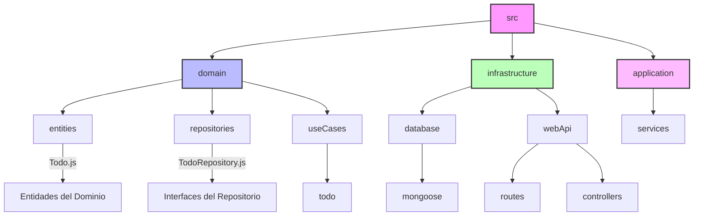

# Estructura del Proyecto

## Diagrama de Arquitectura

## Descripción de las Capas

### Domain (Dominio)

- **entities**: Contiene las entidades principales del negocio (Todo.js)
- **repositories**: Interfaces que definen cómo se accede a los datos
- **useCases**: Casos de uso específicos de la aplicación

### Infrastructure (Infraestructura)

- **database**: Implementaciones concretas de persistencia de datos
  - **mongoose**: Implementación específica para MongoDB
- **webApi**: Capa de presentación web
  - **routes**: Definición de rutas de la API
  - **controllers**: Controladores que manejan las peticiones

### Application (Aplicación)

- **services**: Servicios de la aplicación que orquestan los casos de uso
